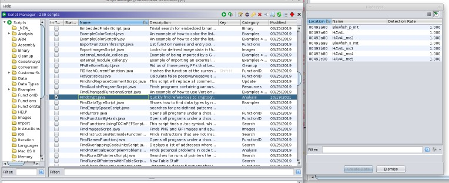
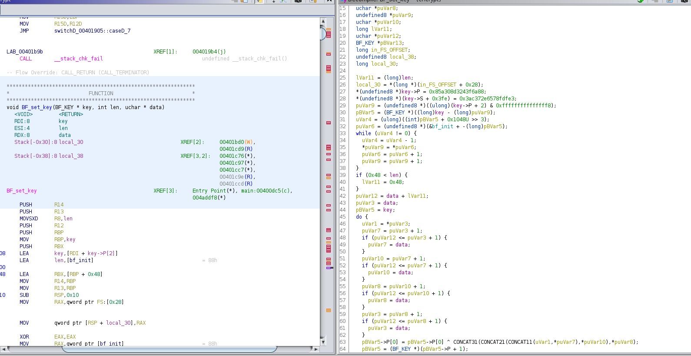
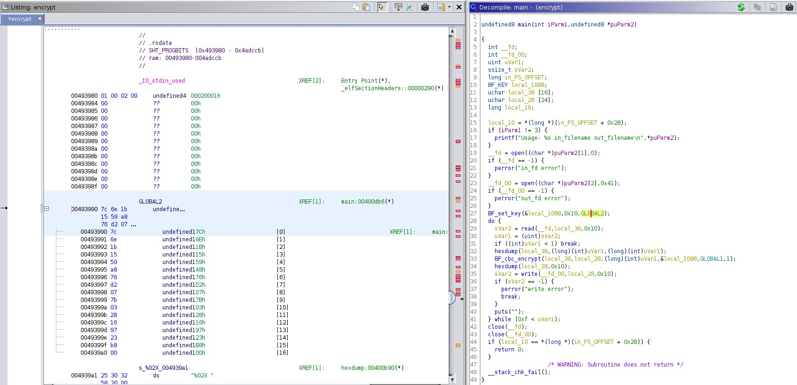
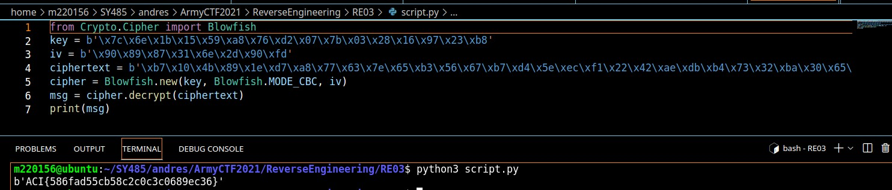

## CTF:  Army Cyber Institute Cyberstakes CTF 2021
Challenge: National Dex #65

Category: Reverse Engineering

Points: 20

Difficulty: Introductory 

## Instructions


**Description**: We found the encryptor (encrypt) but it won't decrypt encrypted?
 <br/>

**Hints**: 
1. I think they're using a cipher designed by Bruce Schneier.
2. When reversing, it's useful to look for magic constants or use a tool like findcrypt (idapython version or Ghidra version).
3. Make sure you're using CBC mode.
	
## Resources

FROM HINT 1 -> https://en.wikipedia.org/wiki/Blowfish_(cipher)

## Solution

1. Download file , the Result: <br/>
	 `objdump -d -M Intel encrypt` -> *display the assembly code for the executable sections of the program*<br/>
	Its a large program, lets look at the symbols <br/>
2. `objdump -t -M Intel encrypt` Not seeing too much here <br/
3. Lets use the hint and open it with ghidra
 * Start a new project
 * Import the file encrpyt
 * Click analyze code
4. Now the hint told us to use a tool like findcrypt so I will start there. Once we have our project, we click the green start button and find find crypt. It gives us the following: <br/>

5. The bf_init array at 0x493a60 is used in a function called BF_set_key so lets navigate there on Ghidra. <br/>
 
6. We can see where the S and P boxes of the Blowfish cipher are created. The key itself is probably passed in as an argument to this function from somewhere else. Following the cross references takes us to the following location: <br/>
 
7. We can see that an array called GLOBAL2 is used as an argument to the BF_set_key function. This is the constant key value that the program uses to perform encryption but we still need to find the IV value. If we look a little further below the GLOBAL2 array, we notice another array called GLOBAL1 which looks like the IV we are looking for.
8. Now we have to create a script to decrpyt using the values we found. 
GLOBAL2 = Key = 7c 6e 1b 15 59 a8 76 d2 07 7b 03 28 16 97 23 b8 00
GLOBAL1 = IV = 90 89 87 31 6e 2d 90 fd 00
`hd encrypted`
<<<<<<< HEAD
`00000000  b7 10 4b 89 1e d7 a8 77  63 7e 65 b3 56 67 b7 d4  |..K....wc~e.Vg..|`
`00000010  5e ec f1 22 42 ae db b4  73 32 ba 30 65 3c 56 64  |^.."B...s2.0e<Vd|`
ciphertext = b7 10 4b 89 1e d7 a8 77 63 7e 65 b3 56 67 b7 d4 5e ec f1 22 42 ae db b4  73 32 ba 30 65 3c 56 64
=======
```
00000000  b7 10 4b 89 1e d7 a8 77  63 7e 65 b3 56 67 b7 d4  |..K....wc~e.Vg..|
00000010  5e ec f1 22 42 ae db b4  73 32 ba 30 65 3c 56 64  |^.."B...s2.0e<Vd|
ciphertext = b7 10 4b 89 1e d7 a8 77 63 7e 65 b3 56 67 b7 d4 5e ec f1 22 42 ae db b4  73 32 ba 30 65 3c 56 64
```
>>>>>>> 4707e25a18c5531c17e1c6384641a49846c1a492
9.  

## Flag

ACI{586fad55cb58c2c0c3c0689ec36}

## Mitigation

**The problem**: This program had a Cryptographic function within it and with tools such as `FindCrypt` we are able to quickly find references to Cryptography functions in the target whic is extremely useful for Reverse Engineering. Also within the program was the Key and IV needed to decrypt, thus we were able to reverse engineer it and find the values and peice it together and implement our own script to decrypt with the vaules we found   <br />
**Soulution**: Externally store the Key and IV such that these values are not also within the source code. Or find a way to obfuscate so a plugin like FindCrypt will not pop out this vaulable info.   <br />
